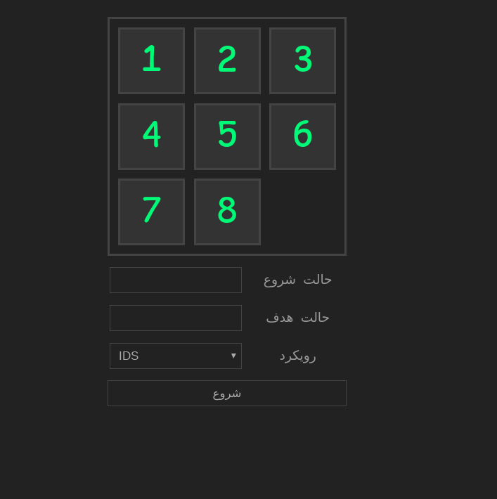

<p align="center"></p>

# Eight Puzzle
Implementation of some heuristic search algorithms to solve the 8-Puzzle problem

## pre-usage

### requirements
- python3
- python3-pip
- virtualenv

### prepare enviroment
```sh
virtualenv -p python3 .venv
source .venv/bin/activate
pip install -r requirements.txt
```

### usage
```sh
python app.py # or flask run
```

open the URL up in your web browser
